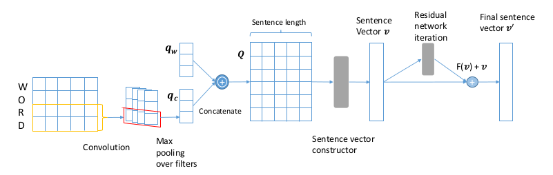
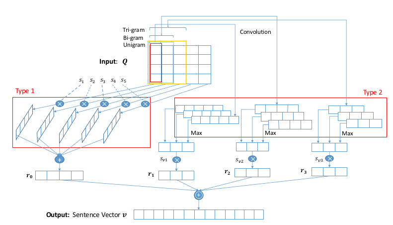

<meta http-equiv="content-type" content="text/html; charset=UTF-8">
# Note for Papers in ICLR 2017 about NLP
**International Conference on Learning Representations known as ICLR is one of the topest Conference. Because I have being concentrating on the representation of the text more, I have done a review of the papers in ICLR on NLP.**
<!--more-->

## 1. Representation of Character, Word and Sentence
**Representations or Embeddings in many ways**

### 1.1 Character-Aware Attention Residual Network for Sentence Representation
**One way about the sentence embedding by Xin Zheng（Nanyang Technological University, Singapore）, Zhenzhou Wu(SAP)**
* Goal: Classify short and noisy text
* Problem: 
  * Feature sparsity using bag-of-word model, with TFIDF or other weighting schemes
  * Bag-of-word method has an intrinsic disadvantage that two separate features will be generated for two words with the same root or of different tenses. In other word, the morphology is very important to understand the information of the short document.
  * Word2vec or Doc2Vec which are distributed word representation miss the word morphology information and word combination information.

* Backgroud: The quality of document representation here has a great impact on the classification accuracy.
* Works of this paper:
  * Take word morphology and word semantic meaning into considerationby using character-aware embedding and word distributed embedding.(This may be the common benefit of the embeddings.)
  * To obtained a sentence representation matrix: concatenate both character-level and word distributed embedding together and arranging words in order. Sentence representation vector is then derived based on different views from sentence representation matrix to overcome data sparsity problem of short text. At last, a residual network is employed on the sentence embedding to get a consistent and refined sentence representation.(The detials will be shown later.)

* Details of the model:
This paper proposes a character-aware attention residual network to generate sentence representation as the Figure shown.
  
  1. A matrix constructed by characters embedding in word is encoded into a vector by convolution network.
  2. Concatenate both character-level embedding and word semantic embedding into a word representation vector.
  3. A sentence is represented by a matrix.
  4. Enrich sentence representation vector by Attention Mechanism: solve the problem that not all the features contribute the same for classification(or other tasks) and target on pertinent parts.
  5. Refine sentence representation vector by Residual network: extracte features from different views consistent.
  6. Obtain the final sentence vector for the classification(or other tasks).

* More details of the model: 
  * Word representation construction: $C$ is vocabulary of characters, $E\\in R^{d\_c\\dot |C|}$ is the character embedding matrix, $d\_c$ is the dimensionality of character embedding, $E^w\\in R^{d\_c\\dot n\_c}$ is word character-level embedding matrix, $E\_i^w=E\\dot v\_i$ where $v\_i$ is a binary column vector that is one row in $E$. Then use convolution network to get the vector $q\_c$ which captures the character-level information.(But I still don't know how does the paper solve the problem that the dimentions of the matrix are not same about all words. Maybe some skills known as the padding?) The character-level embedding can only caputure the word morphological features, therefore concatenating the distributed word representative vector as the reflect of the word semantic and syntactic characteristics.
  * Sentence representation vector construction: shown as below:
  
  Using different weights for every vector of matirx and attention mechanism to enrich the sentence representation.
    * attention mechanism shown as below.
  
    $g\(q\_i\)=Tanh\(W\_{qh}q\_i+b\_{qh}\)$
    $s\_i=\\frac{exp\(g\(q\_i\)\)}{\\sum\_n\_w^{j=i}exp\(g\(q\_j\)\)}, \\hat q\_i=s\_iq\_i$
    * convolution operations on $Q$ with n-grams.
  * Residual Network for Refining Sentence Representation: shown as below:
  
  That is one kind of convolution network. But I konw nothing about the residual.-\_-|| So let it go.:)

* Experiments: The model outperforms stat-of-the-art models on a few short-text datasets.
  * Dataset
  |Dataset|classes|Train Samples|Test Samples|Average Length of text|
  |:-----:|:-----:|:-----------:|:----------:|:--------------------:|
  |Tweet|5|28,000|7,500|7|
  |Question|5|2,000|700|25|
  |AG\_news|5|120,000|7,600|20|
  * Other details of the experiment is ignored by me.:)
  * The result is very good.:)

* High insight:
> * We must explain the word-level representation about the Chinese. And that is important also.
> * Attention mechanism which focuses on specific part of input could help achieve this goal that not all the words in a sentence contribute the same when predicting the sentence's label

# To be continued.

### 1.2 Program Synthesis for Character Level Language Modeling
