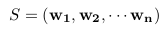
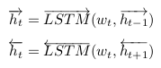
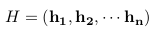
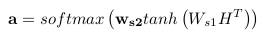
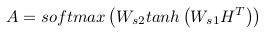
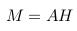
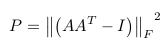
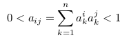

<meta http-equiv="content-type" content="text/html; charset=UTF-8">
# A Self-Attentive Sentence Embedding
**一个自注意力的句子嵌入表达 by Zhouhan Lin, Minwei Feng, Cicero Nogueira dos Santos, Mo Yu, Bing Xiang, Bowen Zhou & Yoshua Bengio for ICLR 2017**

## 摘要
* **本文内容：**提出一个新的模型——通过自注意力提取一个可理解的句子嵌入表达
* 特点：用2维矩阵来表达句子而不是1维向量，其中矩阵的每一行表示句子的不同方面的特征
* 创新：模型中使用自注意力机制和一个特殊的正则项
* 评价：在三个不同的任务中进行评测——author profiling / sentiment classification / textual entailment
* 结果：结果很好哟

## 简介
**本部分主要讲了从词到段落嵌入式表达的发展及重要的方法** 

* 词：词嵌入，一种单个词的分布式表达，可以表示词的语义信息
* 可以很好获得短语和句子的包含语义的分布式表达的方法主要分为两类：
> 1. 通过无监督学习获得的全局句子嵌入表达：SkipThought vectors和DBOW模型。全局训练可以利用大量的不标记的语料。
> 2. 通过监督学习，为某个明确的任务训练得到的句子表达。通常与接下来的任务有关。
> 3. 通常，特定训练的句子表达性能优于全局表达。

* 接下来详细介绍在特定任务下，如何嵌入式表达句子。比如各种RNN和CNN
> 1. 利用注意力机制，在CNN或者LSTM模型上提取信息源来知道提取句子嵌入表达（没理解是什么鬼！！）
> 2. 在LSTM的每步结果上加max pooling / averaging
> 3. 直接利用最后一步的隐藏层作为句子的嵌入式表达

* **本文假设：**获取一个RNN模型的每一步语义表达是相对困难且不必要的。
> * 本文提出的自注意力机制可以将句子不同方面的语义提取至不同的向量表达
> * 本方法利用了LSTM的记忆（即中间输出）

## 方法
### 模型（自注意力机制）
**模型包括两个部分，一部分是biLSTM，另一部分是自注意力机制。biLSTM获得一般隐藏层表达，自注意力机制获得一个权重矩阵。两个矩阵做点积，句子的嵌入式表达（结果是一个矩阵）** 

* biLSTM
> * 每个句子包含n个字（或者词），每个词用d维的Embedding表示（word2vec/Glove/simple），则这个句子表示为一个2维矩阵。此时，句子中的每个词是独立的。 
> 
> * 用双向LSTM(biLSTM)获取单个句子中相邻词的依赖关系。隐藏层的维度是u。 
> 
> * 直接将两个LSTM获得的隐藏层拼接起来，得到n个2u维的向量。 
> 

* 自注意力机制
> * 目标：将在H中的n个结合LSTM隐藏层的向量进行线性组合，获得一个fixed_size（固定长度）的嵌入式表达。 
> 
> * 这个相当于两层MLP。第一层的输入是H^T（一个2u×n的矩阵），权重是Ws1（一个d×2u的矩阵）,激活函数是tanh，输出是一个d×n的矩阵;第二层的输入为第一层的输出，权重是ws2（一个d维向量），激活函数是softmax，输出是自注意机制部分的权重a（一个n维向量）。
> * 将获得的权重a乘以H得到的向量m（一个2u维的向量）作为句子的表达。
> * 上面的步骤，只能表达句子语义的一个方面或者内容。（这个有点牵强），如果需要从多个方面表示句子的语义信息，则要多个自注意力权重。提取一个句子的r个不同的方面。将ws2扩展为Ws2（一个r×d的矩阵），得到的自注意力权重从a扩展为A（一个r×n的矩阵）。这里的softmax仅对输入的第二维作用。 
> 
> * 最后句子的嵌入式表达M（r×2u的矩阵）。 
> 

### 惩罚项
**问题：如果自注意力机制提供相似的权重，句子的嵌入式表达矩阵M就有冗余的问题。所以需要惩罚项，来保证注意力机制得到的不同的求和权重向量尽量多样化（diversity）。** 

* Kullback Leibler divergence：权重向量中的任意两个的KL距离是评价多样性的最好的方法。（不晓得这个距离是个什么鬼！据说计算成本非常大，所以不用这个方法）
* 评价冗余程度：见下图
>  
> * 其中，A是自注意力产生的权重矩阵，I是单位阵，之后求Frobenius范数。类似于L2正则项，惩罚项P将被一个系数相乘，然后之前的loss一起被最小化（这个loss取决于之后的应用）。

* 解释：考虑在权重矩阵A中的两个不同的向量a1和a2，因为softmax函数，A中的每个向量的和应该是1.所以每个向量被视为离散概率分布的概率质量。对AAT任何非对角元素，表示为：
>  
> * 在一种极端情况：两个向量a1和a2没有重叠，那么aij应该是0
> * 在另一种极端情况：如果两个分布是相同的且都表示单个词，那么其值为1。

* 回到刚刚的那个计算冗余度的公式，把AAT减去单位矩阵I，然后求最小值，这样要求AAT在对角线的值接近于1（即每个向量a都尽量少关注几个单词），其他位置的值接近于0（这样防止不同的向量a有冗余）。

* **思考：**避免冗余的方法肯定不止这一种，而且该方法解释的很牵强。我觉得为了更好的实现可解释性，应该从句法格式，包含的词汇和其他含义等考虑。

### 可视化
* 可解释性的“解释”：对于句子嵌入表达矩阵M，其每一行都由权重矩阵A中的a对LSTM的所有隐藏结果进行加权。然后画了四个看不大懂的图。。
* 主要的模型思想就是在BiLSTM的结果上，加入自注意力机制，对所有隐藏层的结果进行加权，得到一个能够嵌入式表达句子语义的矩阵。为了防止自注意力机制得到的结果太相似，加入一个惩罚项，保证同一个自注意力机制的权重向量关注点更集中，不同的自注意力机制的权重向量关注点更多样化。在训练时，惩罚项和任务相关的loss一起作为优化目标。

## 相关工作
* 通过自预测进行句子嵌入式表达（Sentence Embedding via Self-Prediction）：类似于**自编码**的思想，即通过预测自己来嵌入式表达句子。
> * ParagraphVector：优化句子嵌入式表达来预测句子中的以词袋模型表达的句子。
> * Sequential Denoising Autoen-coders (SDAE)：应用基于LSTM的编码解码框架。通过将句子中词的顺序考虑进来，编码器把句子表示为一个嵌入表达，解码器用来预测这个句子。
> * recursive auto-encoder：学习一个句子的句法树的每个节点的嵌入表达，通过预测这个节点的子节点来优化嵌入表达。

* 通过预测临近句子的句子嵌入式表达（Sentence Embeddings via Predicting Adjacent Sentences）：充分利用句子的上下文信息。
> * SkipThought and FastSent：通过预测临近句子来训练句子嵌入表达。一个特殊情况就是利用编码-解码器通过预测双语平行句来训练句子的嵌入表达。

* 总结：
> * 所有的以前的在半监督句子嵌入结构的工作要不是通过在句子中词的嵌入表达上做max/average pooling，要么是直接提取LSTM的最后一层作为嵌入式表达。
> * 这些方法限制了嵌入表达——单个向量不能覆盖和区别在同一个句子的不同方面。
> * **本文工作：**通过结合自注意力机制和矩阵表达，解决了上述问题。
> * **其他工作：**通过利用外部语言结构如分词和依赖树提高句子的表达。但是本文没有利用语言结构来指导句子表达模型。

## 试验结果
**通过三个不同的数据集以三个不同的任务评价句子嵌入模型** 

the Yelp dataset | the Age dataset | the Stanford Natural Language Inference(SNLI) Corpus
------- | -------
sentiment analysis | author profiling| textual entailment

## 结果和讨论
**本文内容：**利用自注意力机制，得到一个固定长度的句子矩阵嵌入表达。 

* 细节：如上面模型部分所示
* 优点：可以将不同长度的序列编码至固定的表达;可扩展性很强，可以不经修改直接应用于更长的文本——段落/文章。
* 其他不重要的。

# 思考
* 引文上下文和整个文档表达之间的相似度，然后ranking。问题在于短文本如何和长文本进行匹配。
* 训练一种翻译模型，从citation context（中） -> abstract（英），可以解决跨语言的引文推荐。 
