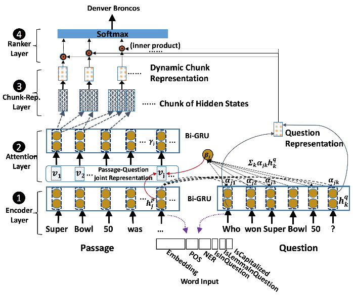
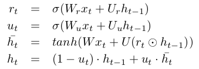
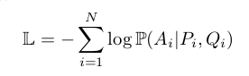

<meta http-equiv="content-type" content="text/html; charset=UTF-8">
# End-to-End Answer Chunk Extraction and Ranking for Reading Comprehension
**阅读理解中端对端的答案提取和排序 by IBM Watson for AAAI 2017**

## 摘要
* **本文内容：**本文提出一个dynamic chunk reader(DCR)——一个端对端的神经阅读理解模型，可以在一个给定的文档集合中，为回答问题提取和排序一个回答候选集。
* 特点：DCR可以预测一个不定长度的回答，而之前的RC模型只能预测单个词或者一个实体。
* 模型概述：DCR把文档和一个输入问题用RNN编码，然后应用一个word-by-word注意力机制来获得一个文档的基于问题的表达。接下来是一个块表达生成器和一个排序模型。
* 实验：结果表明DCR在SQuAD数据集中实现了state-of-the-art提取匹配和F1_score。

## 简介
* 背景：基于问答的阅读理解是一个利用从相关文档提取一个块来回答问题的任务。
* 以前的成果：在给定的文档中提取单个词或者单个实体作为答案; 或者在人工提供的小候选集中通过排序选择一个正确的答案。
* 本文关注的点：利用文本的信息来提高答案的覆盖度，尤其是一些没有关键点的回答。文中说道，除了他们之外，还没有对其进行深入的研究。
* 本文模型简介：dynamic chunk reader(DCR)，不仅在生成和排序候选回答集上与之前的系统明显不同，还在这些工作中分享评价。首先，通过深度学习学习一个更好的候选答案块表达;然后，利用块表达答案候选集而不是按照word-level表达。
* **本文贡献：**
> 1. 本文提出一个新的神经网络模型以结合候选答案块和排序，即答案以一种端对端的形式构建和排序。
> 2. 本文提出一种新的问题注意力机制来提高段落词表达。
> 3. 本文提出几个简单有效的特征来增强注意力机制，从根本上提高了匹配和排序的准确率。

## 问题定义
* 目的：基于一个段落P，通过选择一个句子A，回答一个事实型的或者非事实型的问题Q。
* Q，P，A都是句子序列，共用一个词汇表V。
* 训练集的组成为三元组（P，Q，A）
* 一个问题可能有好多个答案。
* **RC任务的类别：**
> 1. quiz-style，MovieQA：问题有多个选项
> 2. Cloze-style：通常通过代替在句子中的空格来自动生成答案。
> 3. answer selection，TREC-QA：在多给定的段落中，选择一个最好的。
> 4. SQuAD数据集：满足事实型和非事实型的答案提取，更接近于现实世界。

## Baseline：
**cloze-style RC模型，本文将在该模型上进行改进。包括两个部分：1）独立的答案区块，被训练以生成重叠候选区块;2)一个神经RC模型，被用来给文章中的每个词进行打分。具体解释如下：** 
* Answer Chunking:
* Feature Extraction and Ranking

## Dynamic Chunk Reader
* 
* DCR优于其他方法的三个原因：
> 1. 每个块被动态地构建表达，而不是有一个先前定义的特征值
> 2. 每段话的词表达通过word-by-word注意力来提高，来评价段落词和问题的相关性。
> 3. 端对端的训练。

* DCR有四个步骤：
> 1. encoder layer通过使用biRNN分别编码段落和句子
> 2. attention layer计算段落中的每个单词到问题的相关度
> 3. chunk representation layer从给定的段落中动态的提取候选块，生成编码文本信息的块表达
> 4. ranker layer对块表达和给定问题的表达的相关性进行评分，利用softmax层对所有候选块进行排序。

* Encoder Layer: 
利用biRNN对段落和问题中的每个单词进行编码，获得每个单词的隐藏层。（RNN的输入是词嵌入表达和词的其他特征的拼接）。该处使用的RNN模型是GRU。具体计算公式如下：
* Attention Layer: 
本文在word-by-word注意力方法的启发下提出一种新的注意力机制。
* Chunk Representation Layer: 
在给定一个注意力层的输出时，动态生成一个候选答案区块表达。首先决定候选区块的文档边界，接着利用所有或者部分注意力机制的表达输出生成一个区块表达。 
由两个方法生成候选区块：利用POS方法;集合所有可能的区块以最大化单词的数量。本文假设，biRNN的两个end表达的结合可以更好的表示整个文档。
* Ranker Layer: 
利用cosine相似度评价区块表达层得到的每个区块的表达与问题表达的相似度。然后利用softmax对所有候选区块进行评分。
* 目标函数：最小化负log似然函数，如下所示： 

## 实验：
* 数据集：利用Stanford Question Answering Dataset(SQuAD)数据集来做实验。因为它是事实型和非事实型混合问题数据集。一个真实世界的大规模数据集（从536篇维基百科里选择的100k个问答对）。答案从一个词到多个词不等。
* 特征：输入的每个单词的向量表达有6部分——一个300维的GloVe嵌入表达;POS的one-hot编码;NE(name entity)的one-hot编码;一个布尔值表示是否与问题中的词相同……等其他看不懂的。。
* 实现细节：略
* 实验结果：略
