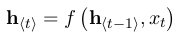
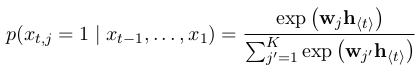
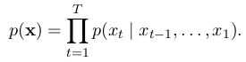
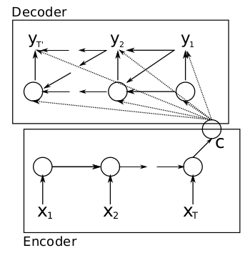
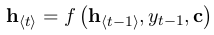
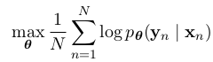

<meta http-equiv="content-type" content="text/html; charset=UTF-8">
# Learning Phrase Representations using RNN Encoder-Decoder for Statistical Machine Translation
**利用编码-解码器为机器翻译学习段落表达 by Bengio in 2014**

## 摘要：
* **本文内容：**提出一个新的神经网络模型——RNN编码-解码器，其包含两个RNN网络。
* 主要内容：其中一个RNN神经网络将一句话编码到一个确定长度的向量表达，另一个RNN神经网络将这个向量表达解码到另一个句子。
* 目标函数：这个模型的编码器和解码器被联合训练以最大化在给定一个源句子的情况下，目标句子的条件概率。
* 结果：提高了统计机器翻译的质量。
* 特点：本次提出的模型，学习到了高质量句子的语法和语义表达。

## 简介
* 深度学习肯定可以被并已经被大量应用于NLP领域：语言模型/段落检测/词嵌入表达。
* 新的神经网络框架可以被作为传统基于段落的统计机器翻译（SMT）系统的一部分。
* **RNN Encoder-Decoder:**其中编码器，将不同长度的源句子映射到一个设定长度的向量，然后解码器把这个固定长度的向量映射到目标语言的不定长度的句子。
* 训练目标是最大化P(target_seq|source_seq)。
* 另外，我们提出利用复杂隐含单元来提高记忆能力和训练情况
* **特点：RNN Encoder-Decoder 学习的段落的连续空间的表达，同时包含了语义和语法结构**

## RNN Encoder-Decoder
1. 初步：RNN
> * RNN(递归神经网络)：在变量长度序列x上进行操作，包括一个隐藏层h和一个选择性的输出y的神经网络。在每个step t中，RNN的隐藏层h的更新如下：  其中，这个f可以是简单的sigmoid函数，也可以是复杂点的LSTM。（递归之名就在于此）
> * **关键：**RNN可以通过预测一个序列的下一个单词（语言模型），学得在一个句子上的概率分布。  计算整个序列x的概率如下：  通过每步生成一个字的办法可以抽取一个新的句子。

2. RNN Encoder-Decoder
> * 本文内容：提出一个新的神经网络框架——编码一个不同长度的序列到一个固定长度的向量表达，然后解码至一个不定长度的序列（这是一种生成模型：初始句子到目标句子的一个条件概率）。框架如下：  
> * 解释：encoder是一个RNN，它的作用就是把序列x的每个项读进来，然后根据rnn模型不停的更新隐藏层。在所有的字符都输入到RNN之后，隐藏层就是整个序列的总结。decoder是另一个RNN，在一个给定的隐藏层h，通过预测下一个符号生成输出句子。 
> * 目标函数：最大化log似然函数： 
> * 作用：给定一个输入序列，模型可以生成一个目标序列;模型可以计算给定输入输出序列对的得分。这个得分是已知输入，输出的条件概率。

## 作用
在机器翻译等取得了极佳的成果

# 小结
* 本文应该是相对较早的seq2seq模型。
* seq2seq也可以应用于文本表达方面。
