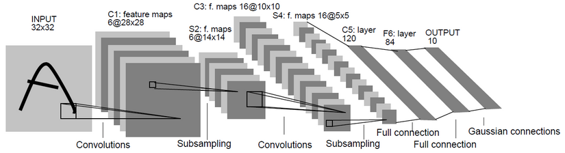

# 手机碎屏识别
**Completed by Heng Ding, Fengchang Yu and Guoxiu He**
<!--more-->
## 1 团队介绍：
1. 丁恒博士：主要负责项目算法模型构建，图像处理和方向指导
2. 于丰畅博士：主要负责图像处理
3. 贺国秀硕士：主要负责算法构建、优化和实现；项目平台展示及咨询服务

## 2 技术思路：
1. 把上传的手机屏幕图片压缩至固定大小（960\*1280）
2. 把手机屏幕图片切成固定大小图片（160\*160）
3. 利用深度学习模型检测每个小切块是否为碎屏
4. 统计该手机屏幕的碎屏个数，大于等于4为碎屏，小于等于1为不碎屏，碎屏个数在2~3之间的，计算检测为碎屏的概率和平均

## 3 依赖工具：
1. OpenCV，是一款开源的图像处理工具，可以对图像进行压缩、读灰度值、二值化、膨胀、腐蚀等操作。用于该项目的图像预处理工作。
2. Deep Learning，深度学习，又叫深度神经网络。碎屏识别项目主要利用深度神经网络中的卷积神经网络，对屏幕切块进行检测（分类是否为碎屏）。
3. tornado，python的web服务器。用于该项目的展示。

## 4 实现过程：
1. OpenCV：
  * 将图片上传后，利用OpenCv读取成Numpy格式的数组
  * 利用Numpy先将图片（矩阵）转置成宽\*高的图片
  * 利用OpenCV把图片压缩成960\*1280的图片
  * 利用Numpy将图片切成48个160\*160的切块
  * 将每个切块利用OpenCV压缩至48\*48大小的图片

2. Deep Learning
  * 准备训练数据：48\*48大小的碎屏切块分别被标注为碎屏和不碎屏
  * 训练一个二分类的卷积神经网络模型（模型详细描述见下）
  * 利用训练好的分类模型对屏幕切块进行检测
  * 对检测结果进行统计
 
3. Tornado
  * 利用Tornado服务器，实现图片的上传、展示、检测、人工标注等任务
  * Tornado和前端应用比较弱，不做详述

## 5 项目结果：
1. 自测：最早刘总给的测试数据达到了98%的准确率
2. 实测：经刘总测试，在实际应用中，达到95%的准确率

# 卷积神经网络介绍
## 1 有监督机器学习：
1. 机器学习分为有监督机器学习和无监督机器学习。
2. 有监督学习是同时把数据和类别同时丢给模型去训练：如分类，预测
3. 无监督学习是没有类别，单纯把数据丢给模型去训练：如聚类，异常检测
4. **最常用的机器学习是有监督的。如在给定标注好的数据集（如给定特征和类别），利用机器学习算法（如随机梯度下降），对机器学习模型（如逻辑回归、决策树、神经网络等）进行优化，已达到评测标准（正确率、召回率等）的方法**

## 2 神经网络：
1. 一种分类方法，其特点是可以自动生成一些抽象特征，以提高分类性能图示如下所示：
2. 解释：第一层为输入层，是模型原有的特征；第二层是隐藏层，其中的每一个神经元都是输入层的加权和，不同的神经元对应着不同的权重；第三层是输出层，对应着类别，其每个神经元是隐藏层的每个神经元的加权和。隐藏层即为神经网络提取的抽象特征，可以使分类效果更好。
3. 优化：利用反向传播算法（梯度下降）对该模型进行优化，获得最终参数（即每一层的权重）。

## 3 卷积神经网络：
1. 卷积神经网络（CNN）是深度神经网络（又称深度学习）的一种，其特点是可以对输入的矩阵进行建模。如下图所示。
   
2. 主要分为卷积、池化和全连接。
  * 卷积如下图所示:
   
   一种局部感知的操作，用数学的方法解释就是一种矩阵运算。
   简单来说，拿一个小矩阵依次扫描图像，对应位置求积然后相加。这个小矩阵是图像的一种抽象特征（如边缘，斜线等）。这个小矩阵就是普通神经网络中的权重，在这里被称之为卷积核。一般来说，一层中的卷积核越多，这一层的表达能力越强。
  * 池化如下图所示：
   
   池化也是一种矩阵操作，其作用是减少卷积层获得参数。
  * 全连接：
   将卷积和池化得到的矩阵转化成一维向量，在其后加分类器，可以完成分类目标。
3. 特点：对图像进行局部感知和建模

## 4 实现工具：
* **利用Python的Keras进行建模、优化和使用。**

# Thanks
