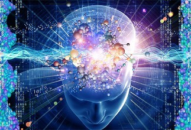

<meta http-equiv="content-type" content="text/html; charset=UTF-8">
# 

# 数据挖掘与知识发现
* Part 1: 基本概念和原理
* Part 2: 数据挖掘在文本中的应用
* Part 3: 深度学习原理及应用
* Part 4: 推荐学习资料

# Part 1：基本概念和原理

## 1.1 数据挖掘的基本概念[1]
1. 定义：从资料中提取出隐含的过去未知的有价值的潜在信息或一门从大量资料或者资料库中提取有用信息的科学,是KDD（资料库的知识发现）的一个主要步骤。
2. KDD的基本流程如下（KDD和data mining在有些情况下区别很少。所以流程基本可以共用）： 

## 1.2 机器学习的基本概念[2]
1. 定义：A computer program is said to learn from experience E with respect to some class of tasks T and performance measure P, if its performance at tasks in T, as measured by P, improves with experience E.
2. 举例解释定义：
> * 说明：本次报告主要讨论的是机器学习中被广泛使用的**监督学习**。无监督学习的过程和监督学习稍有不同，请自行学习。
> * 任务T：用一条线把二维平面中的两种点分割开（如一个分类模型Model）
> * 方法E：尝试二维平面中的所有的线，但是希望寻找这条线的速度能尽量的快（以减少loss为目标）（如各种优化算法Algorithm）
> * 评价P：最后的得到线到底能不能准确的把两种点分割开呢？需要统计分割对的点/分割错的点占所有点比率。当然，分割对的点的比率越大越好，分割错的点的比率越小越好！（如各种评价准则：Accuracy，Recall，F1_score）

3. 基本框架：
> * 机器学习过程  
> * 机器学习各种数据集的关系 

## 1.3 机器学习的原理：Model, Loss, Algorithm 和 Evaluate
1. Model[3]
> * 判别式模型（Discriminative Model）：由数据直接学习决策函数Y=f(X)或者条件概率分布P(Y|X)作为预测的模型，即判别模型。基本思想是有限样本条件下建立判别函数，不考虑样本的产生模型，直接研究预测模型。典型的判别模型包括k近邻，感知机，逻辑回归，决策树，支持向量机，神经网络等。
> * 生成式模型（Generative Model）：由数据学习联合概率密度分布P(X,Y)，然后求出条件概率分布P(Y|X)作为预测的模型，即生成模型：P(Y|X)= P(X,Y)|P(X)。基本思想是首先建立样本的联合概率概率密度模型P(X,Y)，然后再得到后验概率P(Y|X)，再利用它进行分类。典型的生成式模型包括：隐马尔可夫模型，朴素贝叶斯模型，高斯混合模型GMM，LDA等。
> * 本次报告详细讲解机器学习的基础模型：**逻辑回归**。逻辑回归简单/直接，是实际问题中被大量使用的方法。
> > * 逻辑回归要解决的问题是一个二分类的任务。在二维平面中表示为找到一条可以分割两类点的直线。如下图所示：
> >  
> > 目标是每个点离直线越远越好。其中正样本（直线上方）代入直线方程的值越大越好！负样本（直线下方）代入直线方程的值越小越好！ 
> > 上面的问题是不好优化，不够平滑，貌似不可导，没有体现出概率，不好理解等。（这个是个简介，不必深究为什么一定要引入逻辑回归——sigmoid函数）
> > * Logistic函数（sigmoid函数）： 
> >  
> > * 函数图像如下： 
> >  
> > * 解释：任何一个大于0的数代到sigmoid函数后，会得到一个大于0.5的值，反之，会得到一个小于0.5的值。**接上面的分类任务**，把直线上方的点在直线方程的结果代到sigmoid函数后，会得到大于0.5的值。我们可以这样理解，我们有超过0.5的概率把握，认为这个点是一个正样本。反之，我们认为只有小于0.5的概率认为该点是正样本（即是负样本）。也就是说，通过sigmoid函数，我们成功的把一个范围在（负无穷大，正无穷大）的值映射到（0, 1）——可以和概率联系到一起。

2. Loss[4]
> * 损失函数（loss function）是用来估量你模型的预测值f(x)与真实值Y的不一致程度，它是一个非负实值函数，通常使用L(Y, f(x))来表示，损失函数越小，模型的鲁棒性就越好。
> * **log对数损失函数（逻辑回归）：**极大似然估计指，损失函数L(Y, P(Y|X))表达的是样本X在分类Y的情况下，使概率P(Y|X)达到最大值（换言之，就是利用已知的样本分布，找到最有可能（即最大概率）导致这种分布的参数值；或者说什么样的参数才能使我们观测到目前这组数据的概率最大）。加log为了方便求导及获得最大值（因为log函数是单调的）。在整个函数前加符号即可得到loss函数：L(Y, P(Y|X))=-logP(Y|X)
> * **平方损失函数（最小二乘法）:**最优拟合直线应该是使各点到回归直线的距离和最小的直线，即平方和最小。loss函数为L(Y,f(X))=(Y-f(X))2
> * 0-1损失函数: 
>  
> * 绝对值损失函数:L(Y, f(X)) = |Y-f(X)|

3. Algorithm[5]
> * 梯度下降法（Gradient Descent）：梯度下降法是最早最简单，也是最为常用的最优化方法。梯度下降法实现简单，当目标函数是凸函数时，梯度下降法的解是全局解。梯度下降法的优化思想是用当前位置负梯度方向作为搜索方向，因为该方向为当前位置的最快下降方向，所以也被称为是”最速下降法“。最速下降法越接近目标值，步长越小，前进越慢。如图所示： 
>  
> 对线性回归来说，模型表达和loss如下。 
>  
> loss的导数如下。 
>  
> 优化过程 
>  

4. Evaluate[6]
> * Accuracy 和 Recall 
> 如图和公式所示： 
>  
> * F1_Score 
> 公式如图所示： 
>  

## 1.4 小结
实在编不下去了。过两天再说吧。

# Part 2：数据挖掘在文本中的应用
* 文本表达的方法：
> 1. 词袋模型：详细介绍如何利用该方法进行文本表达
> 2. 引入tf-idf加权：词袋模型表达的问题，tf-idf的计算方法
> 3. word2vec：神经网络对词进行表达

* 文本挖掘的任务：感情分析，评论分析，信息检索等

# Part 3：深度学习原理及应用
## 深度学习的各个框架及原理
1. CNN：卷积和池化及最后的全连接
> * 最简单的卷积神经网络——LeNet。
> * 卷积
> * 池化
> * 全连接

2. RNN：RNN的工作原理、特点及常见的几种类型
> * RNN的工作原理，特点
> * RNN的几种常见类型

## 在图像识别和文本分类上的应用
1. CNN：在MNIST和CIFAR100数据集上的分类
> * 输入形式
> * CNN模型
> * 通过最后一层，softmax结果为类别

2. RNN：在IMDB数据集上评论的感情分类
> * 对IMDB数据中的文字，表示为Embedding
> * 通过RNN神经元如（LSTM，GRU等）获得中间层
> * 加一个全连接，得到分类的类别

**我们可以发现，深度神经网络(DNN)的最后一层，通常又回到了全连接层（利用sigmood或者softmax进行激活），其实就是一个逻辑回归模型。也就是说，DNN在最后一层之前做的工作，就是之前机器学习算法中提取特征的过程。不过，这种提取特征的方法不用人工参与，且比人工提取的特征更好。**

# Part 4：阅读文献
* 入门必看的博客，书和课程
> * 博客：博客是前人学习的总结，往往更加简单易懂。所以博客是很好的机器学习入门资料。推荐的博客有：
> * 书：书的重要性不必多说。推荐Bishop的《机器学习与模式识别》/ 李航的《统计机器学习》/ 周志华《机器学习》等。
> * 课程推荐Coursera平台上：Andrew Ng的《机器学习》/ 林轩田的《机器学习基石》和《机器学习技术》/ 华盛顿大学的《机器学习专项课程》等

* 主要的会议、期刊
> * 期刊：JMLR
> * 会议：ICML，ICLR，CRPV和ACL等

* 常用的python工具：numpy，pandas，scikit-learn，graphlab-create，tensorflow，keras，theano和MXNet等。

# 请联系我们
* 您可以在团队公开的github平台上找到电子版的报告：https://github.com/FrankBlood/Study_IR/blob/master/Report/report_for_data_mining.md
* 由于团队才疏学浅，报告内容是在团队掌握的基础理解之上的表达，对重要内容的理解误差和遗漏在所难免。
* 欢迎您的各种批评指正和讨论。
* 联系方式：guoxiu_he@163.com

# Reference
[1] https://zh.wikipedia.org/wiki/%E6%95%B0%E6%8D%AE%E6%8C%96%E6%8E%98
[2] https://zh.wikipedia.org/wiki/%E6%9C%BA%E5%99%A8%E5%AD%A6%E4%B9%A0
[3] http://blog.csdn.net/zouxy09/article/details/8195017
[4] http://www.cnblogs.com/luxiao/p/5783017.html
[5] http://blog.csdn.net/owen7500/article/details/51601627
[6] http://blog.csdn.net/shanglianlm/article/details/46625643

# 备注：
本作业我当时的笔记写到：关于这个主题，我们要介绍概念、原理、发展、主要内容、应用和推荐文献。 
所以我拟定第一部分讲数据挖掘即机器学习的的基本概念。我所谓详细讲并非推导公式，而是尽量结合大量的图，可以形象的向大家介绍。 
第二部分结合我们情报学处理各种文本的特点，讲解下文本挖掘。这部分主要讲如何对文本表达以及机器学习可以处理的文本挖掘的任务（即用什么方法，处理什么问题）。 
第三部分则是讲机器学习在近期的热点部分——深度学习。在这里主要讲解CNN和RNN两种典型的深度框架以及这两种框架在实际中的应用。 
第四部分则是学习机器学习过程中，入门可以看的博客、书和课程，深入的话需要关注的会议和期刊，做实验或者复现别人的结果可能用到的工具。 
**重点：**
> 1. 以上都是我初步拟定的，大家有任何想法都可以商讨和修改
> 2. 大家在准备工作的时候，以markdown的格式直接写到相应的位置，然后再直接用我上次提到的工具转化为ppt，这样可以节省大量的时间。同时可以把我们准备好的markdown转化为pdf作为讲义，打印好发给大家，作为装逼的一部分（偷笑.jpg）。
> 3. 图片保存到imgs文件夹里面。自己写好路径。
> 4. 反正最近不忙，尝试用git来控制版本。大家有问题，随时咨询我。

# Thanks
