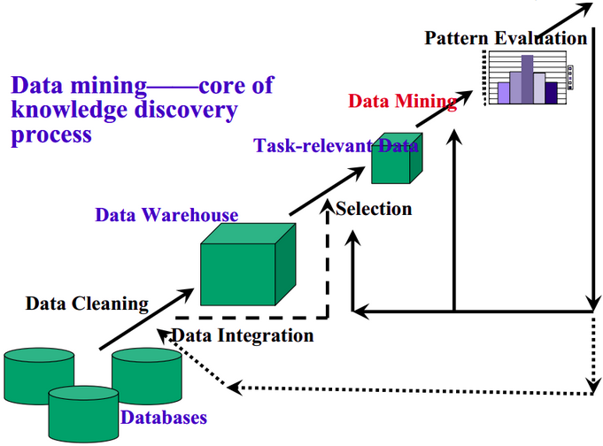

<meta http-equiv="content-type" content="text/html; charset=UTF-8">
# 数据挖掘与知识发现
* Part 1: 基本概念和原理
* Part 2: 数据挖掘在文本中的应用
* Part 3: 深度学习原理及应用
* Part 4: 推荐学习资料

# Part 1：基本概念和原理

## 1.1 数据挖掘的基本概念[1]
1. 定义：从资料中提取出隐含的过去未知的有价值的潜在信息或一门从大量资料或者资料库中提取有用信息的科学,是KDD（资料库的知识发现）的一个主要步骤。
2. KDD的基本流程如下（KDD和data mining在有些情况下区别很少。所以流程基本可以共用）： 

## 1.2 机器学习的基本概念[2]
1. 定义：A computer program is said to learn from experience E with respect to some class of tasks T and performance measure P, if its performance at tasks in T, as measured by P, improves with experience E.
2. 举例解释定义：
> * 说明：本次报告主要讨论的是机器学习中被广泛使用的**监督学习**。无监督学习的过程和监督学习稍有不同，请自行学习。
> * 任务T：用一条线把二维平面中的两种点分割开（如一个分类模型Model）
> * 方法E：尝试二维平面中的所有的线，但是希望寻找这条线的速度能尽量的快（以减少loss为目标）（如各种优化算法Algorithm）
> * 评价P：最后的得到线到底能不能准确的把两种点分割开呢？需要统计分割对的点/分割错的点占所有点比率。当然，分割对的点的比率越大越好，分割错的点的比率越小越好！（如各种评价准则：Accuracy，Recall，F1_score）

3. 基本框架：
> * 机器学习过程  
> * 机器学习各种数据集的关系 

## 1.3 机器学习的原理：Model, Algorithm, Loss 和 Evaluate
1. Model
> * 判别式模型（Discriminative Model）是直接对条件概率p(y|x;θ)建模。常见的判别式模型有 线性回归模型、线性判别分析、支持向量机SVM、神经网络等。
2. Algorithm: 梯度下降法和拟牛顿法等，详细介绍梯度下降
3. Loss: 交叉熵和平均误差等，详细介绍平均误差
4. Evaluate: accuracy, recall 和 F1_score

# Part 2：数据挖掘在文本中的应用
* 文本表达的方法：
> 1. 词袋模型：详细介绍如何利用该方法进行文本表达
> 2. 引入tf-idf加权：词袋模型表达的问题，tf-idf的计算方法
> 3. word2vec：神经网络对词进行表达

* 文本挖掘的任务：感情分析，评论分析，信息检索等

# Part 3：深度学习原理及应用
## 深度学习的各个框架及原理
1. CNN：卷积和池化及最后的全连接
> * 最简单的卷积神经网络——LeNet。
> * 卷积
> * 池化
> * 全连接

2. RNN：RNN的工作原理、特点及常见的几种类型
> * RNN的工作原理，特点
> * RNN的几种常见类型

## 在图像识别和文本分类上的应用
1. CNN：在MNIST和CIFAR100数据集上的分类
> * 输入形式
> * CNN模型
> * 通过最后一层，softmax结果为类别

2. RNN：在IMDB数据集上评论的感情分类
> * 对IMDB数据中的文字，表示为Embedding
> * 通过RNN神经元如（LSTM，GRU等）获得中间层
> * 加一个全连接，得到分类的类别

**我们可以发现，深度神经网络(DNN)的最后一层，通常又回到了全连接层（利用sigmood或者softmax进行激活），其实就是一个逻辑回归模型。也就是说，DNN在最后一层之前做的工作，就是之前机器学习算法中提取特征的过程。不过，这种提取特征的方法不用人工参与，且比人工提取的特征更好。**

# Part 4：阅读文献
* 入门必看的博客，书和课程
> * 博客：博客是前人学习的总结，往往更加简单易懂。所以博客是很好的机器学习入门资料。推荐的博客有：
> * 书：书的重要性不必多说。推荐Bishop的《机器学习与模式识别》/ 李航的《统计机器学习》/ 周志华《机器学习》等。
> * 课程推荐Coursera平台上：Andrew Ng的《机器学习》/ 林轩田的《机器学习基石》和《机器学习技术》/ 华盛顿大学的《机器学习专项课程》等

* 主要的会议、期刊
> * 期刊：JMLR
> * 会议：ICML，ICLR，CRPV和ACL等

* 常用的python工具：numpy，pandas，scikit-learn，graphlab-create，tensorflow，keras，theano和MXNet等。

# 请联系我们
* 您可以在团队公开的github平台上找到电子版的报告：
* 由于团队才疏学浅，报告内容是在团队掌握的基础理解之上的表达，对重要内容的理解误差和遗漏在所难免。
* 欢迎您的各种批评指正和讨论。
* 联系方式：guoxiu_he@163.com

# 备注：
本作业我当时的笔记写到：关于这个主题，我们要介绍概念、原理、发展、主要内容、应用和推荐文献。 
所以我拟定第一部分讲数据挖掘即机器学习的的基本概念。我所谓详细讲并非推导公式，而是尽量结合大量的图，可以形象的向大家介绍。 
第二部分结合我们情报学处理各种文本的特点，讲解下文本挖掘。这部分主要讲如何对文本表达以及机器学习可以处理的文本挖掘的任务（即用什么方法，处理什么问题）。 
第三部分则是讲机器学习在近期的热点部分——深度学习。在这里主要讲解CNN和RNN两种典型的深度框架以及这两种框架在实际中的应用。 
第四部分则是学习机器学习过程中，入门可以看的博客、书和课程，深入的话需要关注的会议和期刊，做实验或者复现别人的结果可能用到的工具。 
**重点：**
> 1. 以上都是我初步拟定的，大家有任何想法都可以商讨和修改
> 2. 大家在准备工作的时候，以markdown的格式直接写到相应的位置，然后再直接用我上次提到的工具转化为ppt，这样可以节省大量的时间。同时可以把我们准备好的markdown转化为pdf作为讲义，打印好发给大家，作为装逼的一部分（偷笑.jpg）。
> 3. 图片保存到imgs文件夹里面。自己写好路径。
> 4. 反正最近不忙，尝试用git来控制版本。大家有问题，随时咨询我。

# Thanks
