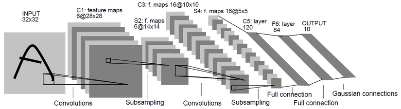

<meta http-equiv="content-type" content="text/html; charset=UTF-8">
# 
---
# 数据挖掘与知识发现
---
* Part 1: 基本概念和原理
* Part 2: 数据挖掘在文本中的应用
* Part 3: 深度学习原理及应用
* Part 4: 推荐学习资料
---
# Part 1：基本概念和原理
---
## 1.1 数据挖掘的基本概念[1]
1. 定义：从资料中提取出隐含的过去未知的有价值的潜在信息或一门从大量资料或者资料库中提取有用信息的科学,是KDD（资料库的知识发现）的一个主要步骤。
2. KDD的基本流程如下（KDD和data mining在有些情况下区别很少。所以流程基本可以共用）： 
---
## 1.2 机器学习的基本概念[2]
* 定义：A computer program is said to learn from experience E with respect to some class of tasks T and performance measure P, if its performance at tasks in T, as measured by P, improves with experience E.
* 举例解释定义：
> * 说明：本次报告主要讨论的是机器学习中被广泛使用的**监督学习**。无监督学习的过程和监督学习稍有不同，请自行学习。
> * 任务T：用一条线把二维平面中的两种点分割开（如一个分类模型Model）
> * 方法E：尝试二维平面中的所有的线，但是希望寻找这条线的速度能尽量的快（以减少loss为目标）（如各种优化算法Algorithm）
> * 评价P：最后的得到线到底能不能准确的把两种点分割开呢？需要统计分割对的点/分割错的点占所有点比率。当然，分割对的点的比率越大越好，分割错的点的比率越小越好！（如各种评价准则：Accuracy，Recall，F1_score）
---
* 基本框架：
> * 机器学习过程 
> * 机器学习各种数据集的关系 
---
## 1.3 机器学习的原理
**Model, Loss, Algorithm 和 Evaluate** 
* Model[3]
> * 判别式模型（Discriminative Model）：由数据直接学习决策函数Y=f(X)或者条件概率分布P(Y|X)作为预测的模型，即判别模型。基本思想是有限样本条件下建立判别函数，不考虑样本的产生模型，直接研究预测模型。典型的判别模型包括k近邻，感知机，逻辑回归，决策树，支持向量机，神经网络等。
> * 生成式模型（Generative Model）：由数据学习联合概率密度分布P(X,Y)，然后求出条件概率分布P(Y|X)作为预测的模型，即生成模型：P(Y|X)= P(X,Y)|P(X)。基本思想是首先建立样本的联合概率概率密度模型P(X,Y)，然后再得到后验概率P(Y|X)，再利用它进行分类。典型的生成式模型包括：隐马尔可夫模型，朴素贝叶斯模型，高斯混合模型GMM，LDA等。
---
> * 本次报告详细讲解机器学习的基础模型：**逻辑回归**。逻辑回归简单/直接，是实际问题中被大量使用的方法。
> > * 逻辑回归要解决的问题是一个二分类的任务。在二维平面中表示为找到一条可以分割两类点的直线。如下图所示： 
> >   
> > 目标是每个点离直线越远越好。其中正样本（直线上方）代入直线方程的值越大越好！负样本代入直线方程的值越小越好！ 
---
> > * Logistic函数（sigmoid函数）： 
> >  
> > * 函数图像如下： 
> > 
---
> > * 解释：
> > 任何一个大于0的数代到sigmoid函数后，会得到一个大于0.5的值，反之，会得到一个小于0.5的值。**接上面的分类任务**，把直线上方的点在直线方程的结果代到sigmoid函数后，会得到大于0.5的值。我们可以这样理解，我们有超过0.5的概率把握，认为这个点是一个正样本。反之，我们认为只有小于0.5的概率认为该点是正样本（即是负样本）。也就是说，通过sigmoid函数，我们成功的把一个范围在（负无穷大，正无穷大）的值映射到（0, 1）——可以和概率联系到一起。
---
* Loss[4]
> * 损失函数（loss function）是用来估量你模型的预测值f(x)与真实值Y的不一致程度，它是一个非负实值函数，通常使用L(Y, f(x))来表示，损失函数越小，模型的鲁棒性就越好。
> * **log对数损失函数（逻辑回归）：**极大似然估计指，损失函数L(Y, P(Y|X))表达的是样本X在分类Y的情况下，使概率P(Y|X)达到最大值（换言之，就是利用已知的样本分布，找到最有可能（即最大概率）导致这种分布的参数值；或者说什么样的参数才能使我们观测到目前这组数据的概率最大）。加log为了方便求导及获得最大值（因为log函数是单调的）。在整个函数前加符号即可得到loss函数：L(Y, P(Y|X))=-logP(Y|X)
---
> * **平方损失函数（最小二乘法）:**最优拟合直线应该是使各点到回归直线的距离和最小的直线，即平方和最小。loss函数为L(Y,f(X))=(Y-f(X))2
> * 0-1损失函数: 
>  
> * 绝对值损失函数:L(Y, f(X)) = |Y-f(X)|
---
* Algorithm[5]
> * 梯度下降法（Gradient Descent）：梯度下降法是最早最简单，也是最为常用的最优化方法。梯度下降法实现简单，当目标函数是凸函数时，梯度下降法的解是全局解。梯度下降法的优化思想是用当前位置负梯度方向作为搜索方向，因为该方向为当前位置的最快下降方向，所以也被称为是”最速下降法“。最速下降法越接近目标值，步长越小，前进越慢。如图所示： 
>  
---
> 对线性回归来说，模型表达和loss如下。 
>  
> loss的导数如下。 
>  
> 优化过程 
>  
---
* Evaluate[6]
> * Accuracy 和 Recall 
> 如图和公式所示： 
>  
> * F1_Score 
> 
---
# 1.4 小结
* 机器学习是数据挖掘的基础，可以分为监督学习与无监督学习。其中监督学习主要包括模型(Model),算法(Algorithm),目标函数(Loss),评价指标(Evaluate)。对于不同的任务，要使用最优的组合去解决。
* 请继续下一部分 

---
# Part 2：数据挖掘在文本中的应用
---
## 2.1 文本挖掘的基本概念[7]
1. 定义：文本挖掘(在文本数据库也称文本数据挖掘或者知识发现)是从大量无结构的数据中提炼出模式(也就是有用的信息和知识)的半自动化处理过程。
2. 技术：文本特征的提取、信息检索、自然语言处理、文本分类、文本聚类、关联分析等等.
---
## 2.2 文本特征表达的方法
* 向量空间模型（Vector Space Model）
> * 概念：把文档表达成为一个n维向量，n为语料库的词汇量，向量的每一维可以用布尔值/词频（tf）/TF-IDF等方法表示。然后通过各种方法计算相似度获得最相关的文档。 简单图示如下图所示：  
> * 布尔值：如上图所示，向量中对应位置的值这样决定——如果该词在文档中出现，则为1,否则为0.
> * 词频（tf）：如上图所示，向量中对应位置的值为该词在文档中出现的频率。
---
> * **TF-IDF**
> > * 词频（Term Frequency） 
> >  
> > * 逆文档频率（Inverse Document Frequency） 
> >  
> > * TF-IDF 
> >  
---
* 主题模型（Topic Model）[8]
> * 简介：两篇文档是否相关往往不只决定于字面上的词语重复（VSM），还取决于文字背后的语义关联。主题模型，就是对文字中隐含主题的一种建模方法。主题就是词汇表上词语的条件概率分布 ，与主题关系越密切的词语，它的条件概率越大，反之则越小;而文档可以表示为主题的条件概率分布;文档与某个主题越相关，它的条件概率越大，反之则越小。
> * 训练方法：pLSA（Probabilistic Latent Semantic Analysis）和LDA（Latent Dirichlet Allocation）。可以通过python的gensim包提供的方法进行训练。
> * 结果：主题的词分布和文档的主题分布。这样我们就可以表示词和文档。
---
* 分布式表达（Distributed Representation）
> * 简介：Distributed representation 最早由 Hinton在 1986 年提出。其基本思想是 通过训练将每个词映射成 K 维实数向量（K 一般为模型中的超参数），通过词之间的距离（比如 cosine 相似度、欧氏距离等）来判断它们之间的语义相似度。
> * 训练工具：Word2Vec和GloVe
> * 不同于之前的表达，分布式表达极大的降低了向量的维度，同时表达方式保存了词的语义和词之间关系等信息。结果展示见下图： 
---
## 2.3 文本挖掘的任务：
* 信息检索
> * 简介：信息检索是从大规模非结构化数据（通常是文本）的集合（通常保存在计算机上）中找出满足用户信息需求的资料（通常是文档）的过程。
> * 过程：对文档(document)和查询(query)进行向量表达。计算相似度，然后按照相似度值对文档进行排序(rank)。选择TopN展示给用户。

* 情感分析：
> * 简介：文本情感倾向性分析，是指对于说话人的态度（或称观点、情感）进行分析，也就是对文本中主观信息进行分析。
> * 方法：将感情分析看作一个分类问题。首先对文本内容进行结构化处理，然后在选定的分类模型中训练，最后对测试数据用模型来预测结果。
---
## 2.4 小结
* 文本挖掘任务结果的好坏很大程度上取决于文档表达的合理性即特征提取的好坏。当取得很好的特征表达之后，将其作为机器学习的输入，通过训练合适的机器学习模型，一般会取得远远优于普通方法的结果。
* 请继续下一部分
---
# Part 3：深度学习原理及应用
---
## 3.1 深度学习的概念及各种框架简介[9]
* 深度神经网络(Deep Neural Network, DNN)
> * 神经网络(Neural Network)：神经网络是基于生物学中神经网络的基本原理，在理解和抽象了人脑结构和外界刺激响应机制后，以网络拓扑知识为理论基础，模拟人脑的神经系统对复杂信息的处理机制的一种数学模型。(听起来很高大上的样子，但实际上就是之前提高到过得逻辑回归一层层叠加起来的一种层次模型。) 图示如下： 
---
> * 解释如下：
> 第一层是输入层，第二层是隐藏层，第三层是输出层：对于一个分类任务来说，第一层是输入(最初提取的特征)，第二层是隐藏层(神经网络提取的特征)，第三层则是输出(目标类别)。 连线解释：第一层到第二层：隐藏层(第二层)的每个神经元与前一层所有神经元的连接可以看作一个感知机(逻辑回归)，这时对应一组参数。隐藏层有n个神经元，那么相当于有n个感知机，对应n组参数。第二层到第三层的连线也类似 激活函数解释：激活函数是为了增加模型的表现能力。第一层到第二层的激活函数一般有sigmoid/tanh/ReLu，第二层到最后一层的激活函数为softmax/sigmoid。 
---
> * 深度神经网络(Deep Neural Network)：
> 没有明确的定义。总之是比原来的神经网络(NN)更深的，也就是有更多隐藏层的都叫深度神经网络，也叫**深度学习**。常见的DNN模型有卷积神经网络(CNN)和递归神经网络(RNN)或它们的混合网络。 
---

* 卷积神经网络(Convolutional Neural Network, CNN)[10]
> * 卷积神经网络图如下所示： 
> * 卷积神经网络有几个非常重要的概念：卷积(Convolutions)，池化(Pooling)，全连接(Full connection)。 
---
> * 卷积：
> 如下图所示：  
---
> * 一种局部感知的操作，用数学的方法解释就是一种矩阵运算。 
> 简单来说，拿一个小矩阵依次扫描图像，对应位置求积然后相加。这个小矩阵是图像的一种抽象特征（如边缘，斜线等）。这个小矩阵就是普通神经网络中的权重，在这里被称之为卷积核。一般来说，一层中的卷积核越多，这一层的表达能力越强。 
---
> * 池化：
> 如下图所示：  池化也是一种矩阵操作，其作用是减少卷积层获得参数。
> * 全连接：将卷积和池化得到的矩阵转化成一维向量，在其后加分类器，可以完成分类目标。 
---

* 递归神经网络(Recurrent Neural Network, RNN)[11]
> * RNN简介：一种是时间递归神经网络（recurrent neural network），另一种是结构递归神经网络（recursive neural network）。如下图所示：  
---
> * RNN的几种常见类型
> 如下图所示：  （1）没有使用RNN的Vanilla模型，从固定大小的输入得到固定大小输出（比如图像分类）。（2）序列输出（比如图片字幕，输入一张图片输出一段文字序列）。（3）序列输入（比如情感分析，输入一段文字然后将它分类成积极或者消极情感）。（4）序列输入和序列输出（比如机器翻译：一个RNN读取一条英文语句然后将它以法语形式输出）。（5）同步序列输入输出（比如视频分类，对视频中每一帧打标签）。
---

## 3.2 在图像识别和文本分类上的应用
1. CNN：在MNIST和CIFAR100数据集上的分类
> * 输入形式图像的原始矩阵resize到固定的大小
> * CNN模型
> * 通过最后一层，softmax结果为类别
---
2. RNN：在IMDB数据集上评论的感情分类
> * 对IMDB数据中的文字，表示为Embedding
> * 通过RNN神经元如（LSTM，GRU等）获得中间层，即获得句子或者段落的向量表达
> * 加一个全连接，得到分类的类别
---
## 3.3 小结
* 我们可以发现，深度神经网络(DNN)的最后一层，通常又回到了全连接层（利用sigmood或者softmax进行激活），其实就是一个逻辑回归模型。也就是说，DNN在最后一层之前做的工作，就是之前机器学习算法中提取特征的过程。不过，这种提取特征的方法不用人工参与，且比人工提取的特征更好。
* 请继续下一部分
---
# Part 4：参考阅读
---
* 入门必看的博客，书和课程
> * 博客：博客是前人学习的总结，往往更加简单易懂。所以博客是很好的机器学习入门资料。推荐的博客有：July
> * 书：书的重要性不必多说。推荐Bishop的《机器学习与模式识别》/ 李航的《统计机器学习》/ 周志华《机器学习》等。
> * 课程推荐Coursera平台上：Andrew Ng的《机器学习》/ 林轩田的《机器学习基石》和《机器学习技术》/ 华盛顿大学的《机器学习专项课程》等
---
* 主要的会议、期刊
> * 期刊：JMLR, MLJ, PAMI
> * 会议：ICML，NIPS, ICLR，CRPV, KDD, AAAI, SIGIR和ACL等
---
* 常用的python工具：
> * 机器学习常用：numpy，pandas，scikit-learn，graphlab-create
> * 深度学习常用：tensorflow，keras，theano和MXNet
---
# Reference
---
[1] https://zh.wikipedia.org/wiki/%E6%95%B0%E6%8D%AE%E6%8C%96%E6%8E%98 
[2] https://zh.wikipedia.org/wiki/%E6%9C%BA%E5%99%A8%E5%AD%A6%E4%B9%A0 
[3] http://blog.csdn.net/zouxy09/article/details/8195017 
[4] http://www.cnblogs.com/luxiao/p/5783017.html 
[5] http://blog.csdn.net/owen7500/article/details/51601627 
[6] http://blog.csdn.net/shanglianlm/article/details/46625643 
[7] http://blog.csdn.net/u011955252/article/details/50732609 
[8] http://blog.csdn.net/huagong_adu/article/details/7937616 
[9] http://blog.csdn.net/eddy_zheng/article/details/50763648 
[10] http://blog.csdn.net/silence1214/article/details/11809947 
[11] http://blog.csdn.net/memray/article/details/48652647 
---
# 请联系我们
---
* 您可以在团队公开的github平台上找到电子版的报告：https://github.com/FrankBlood/Study_IR/blob/master/Report/report_for_data_mining.md
* 由于团队才疏学浅，报告内容是在团队掌握的基础理解之上的表达，对重要内容的理解误差和遗漏在所难免。
* 欢迎您的各种批评指正和讨论。
* 联系方式：guoxiu_he@163.com
---
# Thanks
